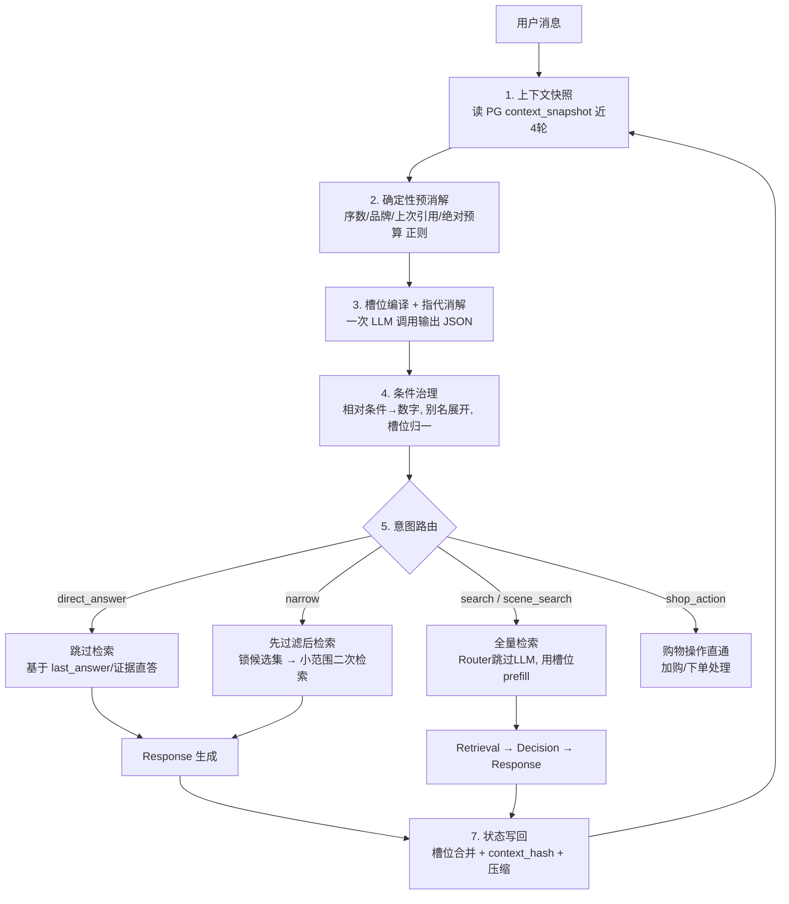

# DialogueGovernor 设计文档 — 多轮对话 query 改写 / 指代消解 / 意图路由

> 状态：设计中（未实现）
> 目标文件：`backend/app/services/dialogue_governor.py`（前置服务）+ `backend/app/services/budget_governor.py`（条件治理）+ 统一写回收敛

## 1. 背景与目标

现状的多轮理解能力由三处分散实现承担，口径不一、职责重叠：

| 现状模块 | 职责 | 问题 |
|---|---|---|
| `FollowUpEngine`（followup_engine.py） | 7 种追问模式正则检测 | 指代解析结果只是拼进 prompt 的"软约束"，不锁定商品 |
| `RouterAgent`（router_agent.py） | LLM 意图 + 约束抽取 | 缓存键不含上下文，依赖历史的 query 会跨会话串答案 |
| `RetrievalAgent._llm_extract_keywords`（retrieval_agent.py） | LLM 关键词改写兜底 | 改写发生在检索阶段，与意图/槽位分离，多一次 LLM 调用 |

目标：**用一个前置子图 DialogueGovernor 统一"理解历史"这件事**，把"语言 → 结构"交给一次 LLM 调用，把"数字计算、商品锁定、别名展开"交给确定性节点，输出可直接消费的槽位 + 改写后 query + 路由意图。

## 2. 关键决策记录

本轮评审确定的五项硬性决策，落地时必须遵守：

| # | 决策 | 要点 | 文档位置 |
|---|---|---|---|
| D1 | context_hash 预计算（强制） | 写回时计算并存快照，请求时零实时计算 | §7 缓存设计 |
| D2 | 压缩与缓存原子联动 | compress_and_save 原子更新 summary + context_hash，无中间状态 | §6 关键决策 / §7 |
| D3 | 规则覆盖校验 | 高置信度字段（绝对预算、resolved_product_id）冲突时规则覆盖 LLM，记录日志 | 阶段 4 |
| D4 | narrow = 先过滤后检索 | last_products 锁候选集 → 候选 ID 过滤的小范围二次检索 | 阶段 5 |
| D5 | pending_question 问答链 | needs_clarification 置 pending_question；下轮先检查、配对解析、成功后清空 | 阶段 5 / 阶段 7 |

## 3. 总体架构



## 4. 阶段设计

### 阶段 1：上下文快照

**存储位置**：PostgreSQL `conversations.context_snapshot` JSONB（唯一事实源）；`ConversationService._snapshot_cache` 仅作读缓存。

快照结构（在现有基础上扩展）：

```json
{
  "constraints": {"category": "美妆护肤", "budget_max": 100, "exclude_tags": ["酒精"]},
  "current_turn": {"category": "美妆护肤", "sub_category": "洗面奶", "budget_max": 100},
  "last_products": [{"product_id": "P001", "title": "...", "brand": "...", "price": 129}],
  "last_query": "推荐100以内的控油洗面奶",
  "last_answer": "...",
  "last_intent": "search",
  "pending_question": null,
  "recent_turns": [
    {"turn_id": "t1", "user_query": "...", "assistant_answer": "...", "product_ids": ["P001"],
     "slots": {...}, "tokens": 210}
  ],
  "conversation_summary": "用户想要100以内控油洗面奶...",
  "context_hash": "sha256:<写回时预计算，见 §7 缓存设计>",
  "compression_in_progress": false
}
```

要求：
- `recent_turns` 保留**近 4 轮原文**（当前 `_build_recent_turns` 只保留 3 轮，需改）；
- 每轮记录 `slots`（该轮解析出的槽位）与 `tokens`（供压缩触发判断）；
- `recent_turns` 只做短期窗口，窗口外信息一律由 `conversation_summary` + 累积约束承接；
- `context_hash` 在每次快照更新时同步预计算（见 §7），请求侧读取即用，禁止实时计算。

### 阶段 2：确定性预消解（规则层）

在调用 LLM 之前先用正则解决"可确定"的指代，避免把精确问题丢给 LLM：

| 模式 | 规则 | 产出 |
|---|---|---|
| 序数指代 | 复用现有 `_ORDINAL_PATTERN` + 中文数字映射（收敛 followup_engine / agent_stream / response_agent 三份重复实现为一份） | `resolved_product_id` |
| 品牌/标题引用 | 对 `last_products` 做品牌/标题子串匹配（配 `BRAND_ALIASES` 中英别名归一） | `resolved_product_id` |
| 上次引用 | `_LAST_REF_PATTERN`（"刚才那个/这个"） | 首个商品 ID |
| 绝对预算 | `detect_budget` / `_BUDGET_PATTERN`（"200以内"） | `budget.max`（显式，不参与相对计算） |
| 购物/对比信号 | 现有关键词词库 | 路由 hint |

预消解结果作为**提示**注入阶段 3 的 LLM prompt，同时作为**校验**：LLM 输出与规则冲突时，规则优先。

**高置信度字段（规则层主导）**：绝对预算 `budget.min/max`（正则提取）、`resolved_product_id`（序数/品牌匹配）、显式购物意图。规则与 LLM 冲突时规则覆盖，具体执行细则见"阶段 4 冲突校验"。

### 阶段 3：槽位编译 + 指代消解（一次 LLM 调用）

输入：当前 query + 近 4 轮快照（原文 + 每轮槽位）+ 预消解结果 + 摘要。

输出（pydantic 校验，见 §5 Schema）：

```json
{
  "intent": "search",
  "confidence": 0.92,
  "rewritten_query": "便宜一点的控油洗面奶",
  "category": "美妆护肤",
  "sub_category": "洗面奶",
  "budget": {"min": null, "max": 80, "raw": "便宜一点", "modifier": "cheaper"},
  "brand": null,
  "exclusions": ["酒精"],
  "resolved_product_id": null,
  "needs_clarification": false
}
```

Prompt 要点（基于现有 `_ROUTER_PROMPT` 扩展）：
- 仅当存在代词/省略/隐性引用时才改写 query，否则原样返回（防漂移）；
- 槽位只填用户明确或可推断的信息，未知一律 `null`，禁止编造；
- 相对价格只输出 `modifier`（如 `cheaper`），**禁止 LLM 做乘法**；
- 输出严格 JSON，失败回退：用预消解规则槽位 + 原 query。

### 阶段 4：冲突校验 + 条件治理（确定性节点）

职责：把 LLM 的"语言条件"转成检索可用的"数字条件"。**不允许 LLM 做算术。**

**4.1 规则覆盖校验（LLM 输出后，D3）**

- 对比字段：仅限高置信度字段——绝对预算 `budget.min/max`、`resolved_product_id`、显式购物意图；
- 覆盖规则：LLM 值 ≠ 规则值 → 强制用规则值覆盖。示例：规则 `detect_budget` 提取 5000，LLM 误解析为 6000 → 用 5000；
- 日志记录：每次覆盖写一条结构化日志 `{query, field, rule_value, llm_value, timestamp}`，用于统计 LLM 冲突率和优化 Prompt；
- 冲突不阻塞：覆盖后继续走条件治理与路由，不额外兜底。

**BudgetGovernor 映射表**（可配置）：

| 修饰词 | 系数 | 示例 |
|---|---|---|
| 便宜一点 / 稍微便宜 | ×0.8 | 100 → 80 |
| 再便宜点 / 更便宜 | ×0.7 | 100 → 70 |
| 贵一点 | ×1.2 | 100 → 120 |
| 差不多 / 别太贵 | ×0.95 | 100 → 95 |
| 预算翻倍 | ×2.0 | 100 → 200 |
| 减半 | ×0.5 | 100 → 50 |

规则：
- 输入 = 修饰词 + **上一轮 budget 槽位**（来自快照累积约束，如 100）；
- 输出 = `budget.max = round(100 × 0.8)`；
- 无上一轮预算且用户只说"便宜一点" → 语义缺失，置 `needs_clarification=true` 或保持无预算；
- 结果钳制：`budget.min ≤ budget.max`，下限 ≥ 0；
- 绝对预算（"200以内"）不经此节点，阶段 2 直接产出。

**槽位归一化**（LLM 槽位 → 下游可消费）：

| LLM 槽位 | 归一化去向 | 下游消费 |
|---|---|---|
| category / sub_category | `Constraints.category / sub_category` | ChromaDB metadata 过滤（`search_chunked`） |
| budget.min / max | `Constraints.budget_min / budget_max` | 价格过滤 |
| scene | 映射现有 scenario 枚举（commute/flight/sport/outdoor/desk/travel...） | 场景过滤/语义 |
| exclusions | `Constraints.exclude_tags` + `expand_brand_aliases` | `_filter_products` |
| brand | 有 `resolved_product_id` 则锁定；否则并入 must_tags + 别名展开 | 语义加权（品牌硬过滤通道列为开放问题） |
| skin_type / benefit | 并入 `spec_keywords` / `must_tags` | 向量加权（入库 metadata 列为开放问题） |
| rewritten_query | `WorkflowState.user_query` | 检索主查询（替换当前"原query+[Follow-up]标注"的富化方式，消除检索污染） |

### 阶段 5：意图路由

| 意图 | 行为 | 说明 |
|---|---|---|
| `search` | 全量检索 | 槽位齐全时 Router 走 prefill 快速路径跳过 LLM |
| `narrow` | 先过滤后检索 | 有序数/品牌/上次引用命中时；从 `last_products` 锁候选集，候选 ID 过滤的小范围二次检索 |
| `direct_answer` | 跳过检索直接回答 | 基于 last_answer / evidence / conversation_summary；"刚才那款能上飞机吗" |
| `scene_search` | 场景驱动检索 | scenario + scenario_keywords 进检索 |
| `shop_action` | 购物操作直通 | 复用 agent_stream 现有加购/下单分支 |
| `chitchat` | 不检索，闲聊回复 | 现有行为 |

路由守卫：
- `confidence < 0.6` → 一律回退 `search`（保持现状兜底行为）；
- 规则强信号（如显式购物词）不被 LLM 覆盖（沿用现有 HIGH_CONFIDENCE_INTENTS 逻辑）。

**narrow：先过滤，后检索（D4）**

1. **锁定候选集**：根据 `resolved_product_id` / `brand` 从 `last_products` 中选出小候选集（默认 ≤5 个）；
2. **针对性检索**：将候选 ID 列表作为过滤条件传给检索引擎（ChromaDB 新增 `candidate_ids` 过滤参数），在候选集内做一轮小范围语义检索，补充新证据（如用户追问"这款的屏幕怎么样"）；
3. **理由**：直答无法利用 RAG 证据；全量检索成本高；候选集内二次检索是成本与效果的最佳平衡；
4. **兜底**：候选集为空（快照过期/商品下架）→ 回退 `search`。

**pending_question：问答链 / Clarification（D5）**

- **设置**：`GovernorSlots.needs_clarification=true` 时，DialogueGovernor 返回反问内容，同时把**用户本轮原始问题**写入快照 `pending_question`；
- **拦截**：下一轮开始时优先检查 `pending_question`，存在则进入问答链模式；
- **关联**：将"上一轮 pending_question + 本轮用户回复"拼成完整问答对，注入阶段 3 的 LLM 编译 prompt（复用现有 Router 问答链逻辑：短肯定词"要/好/行"直接以问题为 query）；
- **清空**：解析成功后清空 `pending_question`；若本轮仍未澄清，保留并累计追问。

### 阶段 6：下游工作流对接

`run_workflow` 调用参数变化：

```python
state = await run_workflow(
    user_query=governor.rewritten_query,      # 不再是 "原query + [Follow-up] 标注"
    prefill_state=build_prefill(governor.slots),  # Constraints + RetrievalPlan
    context_prompt=governor.context_prompt,       # 仅 Response Agent 使用
    ...
)
```

可选演进：将 DialogueGovernor 作为正式节点插入 `graph.py` 的 StateGraph（START 之后），与现有节点同图。

实现依赖：narrow 分支需要 `text_retriever.search_chunked` 支持 `candidate_ids` 过滤参数（新增能力，M3 落地）。

### 阶段 7：状态写回 + 滚动窗口压缩

统一写回点（收敛 agent_stream / recommend / graph 三处写入）：

1. **本轮槽位立即合并进累积约束**（结构化通道，不等压缩）；
2. 追加当前轮到 `recent_turns`（含 slots + tokens）；
3. **重新计算 `context_hash` 并随快照一起写入**（D1，见 §7，强制）；
4. 调用 `check_and_compress`（见 §6）；
5. 提取 `pending_question`、更新 `last_products / last_query / last_answer`；`needs_clarification=true` 时置 pending_question；
6. 异步压缩（不阻塞 SSE 响应）。

## 5. 槽位 Schema（pydantic）

```python
class BudgetSlots(BaseModel):
    min: float | None = None
    max: float | None = None
    raw: str | None = None          # 原文片段，如 "200以内" / "便宜一点"
    modifier: str | None = None     # cheaper / pricier / same / double / half

class GovernorSlots(BaseModel):
    intent: Literal["search", "narrow", "direct_answer", "scene_search", "shop_action", "chitchat"]
    confidence: float = 0.0
    rewritten_query: str
    category: str | None = None
    sub_category: str | None = None
    skin_type: str | None = None
    budget: BudgetSlots = BudgetSlots()
    scene: str | None = None
    benefit: list[str] = []
    brand: str | None = None
    exclusions: list[str] = []
    spec_keywords: list[str] = []
    must_tags: list[str] = []
    resolved_product_id: str | None = None
    needs_clarification: bool = False
```

校验与兜底链：

```
LLM JSON 解析失败 / pydantic 校验失败
  → 使用预消解规则槽位 + 原 query
  → 仍失败 → 按现有 FollowUpEngine 行为兜底（最差退回原 query 全量检索）
```

## 6. 滚动窗口压缩设计

### 参数

| 参数 | 值 | 说明 |
|---|---|---|
| `WINDOW_SIZE` | 4 | 保留近 4 轮原文 |
| `BATCH_THRESHOLD` | 3 | 滑出窗口 ≥ 3 轮触发攒批压缩 |
| `TOKEN_BUDGET_PER_TURN` | 1500 | 单轮安全阀（防超长粘贴） |
| `TOKEN_BUDGET_BATCH` | 2500 | 批量总量阈值（防多轮累积撑爆） |

### 触发逻辑（修正版）

```python
def check_and_compress(cid, conv_svc):
    turns = conv_svc.get_recent_turns(cid)
    if len(turns) <= WINDOW_SIZE:
        return

    expired = turns[:-WINDOW_SIZE]
    total_tokens = sum(t["tokens"] for t in expired)
    batch_ready = len(expired) >= BATCH_THRESHOLD
    token_over = (
        total_tokens > TOKEN_BUDGET_BATCH
        or any(t["tokens"] > TOKEN_BUDGET_PER_TURN for t in expired)
    )

    if (batch_ready or token_over) and not conv_svc.is_compressing(cid):
        conv_svc.mark_compressing(cid)
        active = turns[-WINDOW_SIZE:]          # 立即收缩窗口，避免竞态
        conv_svc.set_recent_turns(cid, active)
        asyncio.create_task(
            compress_and_save(cid, conv_svc, old_summary, expired, on_done=unmark)
        )
```

### 关键决策

1. **移除时机**：触发时立即收缩窗口，把 `expired` 批次传给异步任务（简单版）。稳妥版为按 `turn_id` 移除、压缩成功后再清理——默认采用简单版，购物对话中用户下一条消息通常在压缩完成后到达。
2. **并发守卫**：conversation 级 `compression_in_progress` 标记，防止重复压缩任务。
3. **槽位合并发生在写回时**（阶段 7 第 1 步），不依赖压缩——结构化信息不走摘要。
4. **压缩输入**：`old_summary + expired 轮次（含 slots）`，prompt 指示"将滑出窗口轮次中的事实并入摘要；槽位类信息已由约束层管理，不要重复记账"。
5. **失败处理**：失败保留旧摘要、写日志、最多重试一次；丢失边界 = 当前过期批次（可接受，但需可观测）。
6. **摘要职责**：只承载非结构化事实/态度（"用户嫌贵""喜欢浅色系"）+ 4 轮窗口外的引用兜底；品类/预算/排除等结构化信息一律走槽位累积。
7. **摘要与哈希原子更新（D2）**：`compress_and_save` 成功生成新摘要后，必须**一次更新** `conversation_summary` + `context_hash`（单条 UPDATE，天然原子）；禁止分两次写，避免中间状态。用户若在压缩完成前发消息，读到旧哈希 = 旧缓存键，仅"错过"一次摘要更新，不会串答案。

## 7. 缓存设计

### 现状问题

`make_key("router_intent", user_query)` 只按 query 缓存，依赖历史的 query（如"便宜一点"）会跨会话串答案。

### 缓存键

```python
key = make_key(
    "dialogue_governor",
    user_query,
    snapshot["context_hash"],      # 读取即用，零实时计算
    conversation_id,
)
```

`context_hash = sha256(recent_turns + conversation_summary + 累积约束)`。

### context_hash 预计算（D1，强制）

| 时机 | 动作 |
|---|---|
| 写回时（阶段 7 第 3 步） | recent_turns / conversation_summary / constraints 任一更新后，立即计算 `context_hash` 并随快照一起写入 |
| 请求时 | 直接从快照读 `context_hash` 构建缓存键，**禁止实时拼接 + 哈希** |

> 依据：每次请求实时哈希近 4 轮原文 + 摘要，在高并发下是主链路不必要的 CPU 开销；写回频率远低于请求频率，预计算摊薄成本。

### 压缩与缓存联动（D2）

- `compress_and_save` 成功后**原子更新** `conversation_summary` + `context_hash`（单次快照更新）；
- 用户若在压缩完成前发消息 → 读到旧哈希 → 命中旧缓存键 → 仅"错过"一次摘要更新，**不会**基于旧摘要产生错误的新缓存；
- 下一次请求必然读到新快照（新哈希）→ 自动绕过旧缓存，无需主动失效。

### TTL

对话级缓存 TTL 5~10 分钟（购物意图高度时效，防止话题切换后串上下文）；超时自动失效，避免 Redis 内存膨胀。

## 8. 落地步骤

| 里程碑 | 内容 | 验收 |
|---|---|---|
| M1 | 槽位 Schema + DialogueGovernor 服务 + LLM 编译 prompt | 单轮/多轮 JSON 输出正确率 |
| M2 | 冲突校验（D3）+ BudgetGovernor + 槽位归一化 | 相对预算算术 100% 确定性（单测）、覆盖日志正确 |
| M3 | 意图路由分支（narrow 先过滤后检索 + candidate_ids 过滤 + direct_answer） | 分支命中准确率、二次检索证据增益 |
| M4 | 滚动窗口压缩 + context_hash 预计算（D1/D2）+ 统一写回 | 压缩成本、信息不丢、缓存键正确性 |
| M5 | pending_question 问答链（D5）+ 兜底链 + 评估集 | 端到端指标、LLM 冲突率下降 |

## 9. 评估与验收

构建 30~50 组多轮对话用例（覆盖：序数指代、品牌引用、上次引用、相对预算、话题切换、问答链、闲聊），对比新旧管线：

- 改写准确率（rewritten_query 是否保留原意）
- 槽位提取 F1（category/budget/exclusions/scene）
- 预算算术准确率（应为 100%，确定性节点）
- 路由准确率（search / narrow / direct_answer / scene_search）
- 规则覆盖事件数 / LLM 冲突率（D3 日志统计）
- 问答链（pending_question）链路正确率（设置 → 拦截 → 配对 → 清空）
- narrow 二次检索证据增益（相比直答）
- 端到端回答质量（人工打分）
- 延迟对比（目标：新增前置治理 ≤ 一次 LLM 调用开销）
- 压缩成本（LLM 调用次数：每轮 1 次 → 每 3 轮 1 次）
- 缓存键正确性（无跨会话串答案、压缩后自动绕过旧缓存）

复用现有 `scripts/run_chat_eval.py` 与 `eval_queries` golden 机制扩展多轮评估。

## 10. 开放问题

1. `brand` 是否需要新增硬过滤通道（现在只做语义加权）。
2. `skin_type / benefit` 是否入库为 metadata 过滤字段（涉及入库与 embedding 重建）。
3. DialogueGovernor 先做前置服务（低风险）还是直接并入 StateGraph 节点。
